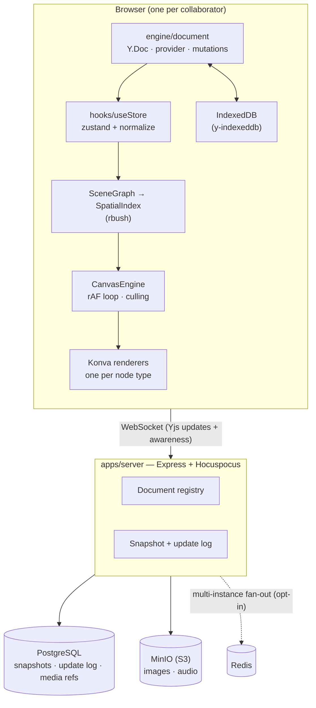

# Vega-Canva

A real-time collaborative infinite canvas. Multiple people draw, write, and talk
on one unbounded 2D surface, with CRDT sync, offline editing, client-side
physics, and true vector export.

Originally built for a Vega-IT hackathon; since substantially rebuilt.

---

## Running locally

Infrastructure (Postgres, Redis, MinIO, and the sync server) is containerised:

```bash
docker compose up -d --build     # sync server on :3000
npm install                      # once, at the repo root (npm workspaces)
npm run dev -w apps/frontend     # Vite on :5173
```

Open `http://localhost:5173`. You land on a dashboard; creating a workspace
navigates to `/room/:id`. Copy that URL into another window to collaborate.

```bash
npm test -w apps/frontend        # Vitest
npm run build -w apps/frontend   # tsc -b && vite build
npm run lint -w apps/frontend    # oxlint
```

Endpoints are derived from the host that served the page (see
`utils/endpoints.ts`), so opening a room link from another machine on the LAN
works without configuration. Override with `VITE_SERVER_HOST` / `VITE_WS_URL`
when the frontend and sync server are on different hosts.

---

## Architecture



Sync uses CRDTs (Yjs), so there is no authoritative ordering server — clients
converge without one, which is also what makes offline editing work: edits made
while disconnected merge on reconnect rather than being rejected.

### The document layer — `engine/document/`

The single owner of collaborative state. Everything else subscribes to it; it
depends on nothing above it.

| Module | Responsibility |
| --- | --- |
| `doc.ts` | `Y.Doc`, Hocuspocus provider, IndexedDB persistence, the shared maps, connection status |
| `mutations.ts` | The **only** write path. Stamps z-index, timestamps and authorship so no caller can forget them |
| `observe.ts` | The **only** observer of the objects map. Publishes a `{changed, removed}` id set |
| `normalize.ts` | Maps any persisted node — current or legacy — onto the canonical schema |
| `migrateDoc.ts` | Idempotent, transactional rewrite of a stored document to the current schema |

Two invariants worth knowing before changing anything here:

- **All writes go through `mutations.ts`.** New nodes always land on top of the
  stacking order and always carry `createdAt`/`updatedAt`/`createdBy`, because
  those are stamped centrally rather than by each tool.
- **All reads are normalized at the boundary.** `useStore` normalizes each
  changed node once, so nothing downstream ever sees a legacy field.

### The document model — `engine/model/schema.ts`

One canonical shape per node type, governed by two rules:

1. **`width`/`height` on the base node are the only source of bounds.** Nothing
   else stores a size.
2. **`geometry` is form; `appearance` is paint.** Nothing lives in both.

```ts
BaseNode   x, y, width, height, rotation, scaleX, scaleY, opacity,
           zIndex, parentId?, locked, hidden, title?,
           createdBy, createdByName?, createdByColor?, createdAt, updatedAt

TextNode   text, typography, autoHeight
ShapeNode  geometry{kind}, appearance{fill,stroke,shadow,cornerRadius}, text?, typography?
StickyNode text, theme, fontSize, author, reactions, tags, pinned
PathNode   geometry{kind:'freehand'|'bezier', …}, appearance
ImageNode  src, appearance, crop?, filters?
AudioNode  src, durationMs, waveform, author, transcript?
```

`typography` keeps `fontWeight` and `italic`/`underline` as separate orthogonal
fields. Konva wants them combined into a single `fontStyle` string; that
translation happens in exactly one place
(`components/canvas/renderers/shared.ts`).

Documents written by older clients still render correctly — `normalize.ts`
handles them on read — and converge to the canonical shape via a one-time
migration guarded by `schemaVersion` in the document metadata.

### Rendering — `components/canvas/`

`ObjectRenderer` owns what is shared across every node type: transform,
selection, dragging, editing lifecycle, presence. Drawing dispatches to a typed
per-type renderer. Objects rotate and scale about their centre, so the group sits
at the centre with its contents offset back — which means `e.target.x()` during a
drag reports the centre, exactly what the physics body expects.

- **One shared `<Transformer>`** (`SelectionTransformer`), re-pointed at the
  current selection rather than one mounted per object.
- **One shared `NodeEditor`** serves text, shape labels, stickies and comments.
  It positions itself in screen space from the camera rather than through Konva's
  transform tree, which is what keeps the caret glued to the object through pan
  and zoom.

### Performance

Built around the assumption that the document is large and the viewport is small.

- **Spatial culling.** `SceneGraph` maintains bounds (rotation included);
  `SpatialIndex` is an R-tree; `CanvasEngine` queries it once per frame with a
  300px overscan and publishes a visible-id set. A 500-object query measures
  ~0.004ms.
- **Per-object subscriptions.** Each renderer subscribes to its own node, so
  moving one object re-renders one object.
- **Virtualized Layers panel** (`useVirtualRows`) — a DOM row per object is by
  far the most expensive consumer of document changes at scale.
- **Camera applied outside React.** The rAF loop writes stage position and scale
  imperatively; panning and zooming do not re-render the tree.
- **Awareness-driven physics.** In-flight objects are broadcast over awareness and
  read through one shared subscription, never per-object polling.

Measured on a 500-object scene: **~5.7ms** to commit a single object move.

### Physics — `hooks/usePhysics.ts`

Matter.js, client-authoritative, with **single-writer ownership**: every client
runs its own world, so exactly one client owns an object while it is in motion.
The owner simulates and commits the final position; everyone else renders the
owner's broadcast flight path. Without that, two clients settle the same object
at slightly different resting positions and fight over the write.

Objects have material profiles (`utils/behaviorSystem.ts`) — a sticky floats, an
image carries momentum, a voice note is bouncy. Physics is a global toggle and is
persisted.

### Export — `engine/export/`

A registry of exporters behind one service. All three formats frame the
**document bounds**, computed by a shared helper, so they agree with each other
regardless of where the camera happens to be.

- **PNG** — reframes the Konva stage onto the content box, captures, restores.
  Clamped to a maximum canvas edge. Audio players are DOM overlays and are
  therefore absent.
- **SVG** — serializes CRDT state to real vector primitives, escaping user text.
  Audio becomes a labelled placeholder; comment pins are excluded, as in Figma
  and Illustrator.
- **JSON** — canonical node data plus comment threads.

### Collaboration surfaces

Cursors, selection outlines, the viewport radar, per-object "editing" badges and
emoji gestures all ride on Yjs awareness rather than the document, so ephemeral
state never enters history. Cursor positions are throttled to 15Hz and smoothed
by local interpolation.

Authorship is denormalized onto each node at creation, so a node still shows who
made it after that person disconnects.

### Design system — `index.css`

Two token layers, and only two: **primitives** (raw values, no meaning) and
**semantic roles** (what the UI references). Components reference semantic tokens
only. Includes a type scale, space scale, radius scale, elevation ramp, one global
`:focus-visible` ring, and `prefers-reduced-motion` handling.

All six text roles meet WCAG AA contrast in both themes. The theme follows the OS
preference until the user chooses, then persists.

---

## Repository layout

```text
apps/
  frontend/
    src/
      engine/
        document/    CRDT ownership, mutations, normalization, migration
        model/       the canonical schema
        objects/     per-type capability registry (drives the inspector)
        tools/       tool implementations behind one interface
        export/      exporter registry
        presence/    awareness-backed collaboration state
        physics/     shared in-flight state
        interaction/ grid snapping
        cursor/      custom cursor system
      components/
        canvas/      renderers, node editor, shared transformer
        workspace/   header, tool dock, presence avatars
        ui/          primitives (Switch, NumberStepper, colour picker, …)
      hooks/         store, sync binding, breakpoints, focus trap, virtualization
      utils/         minimap engine, layout, offline media queue, path simplifier
  server/
    src/             Express + Hocuspocus, S3 uploads, snapshots, retention
docs/                architecture notes, data model, PRD, build plan
```

## Tech stack

**Frontend** — React 19, Vite, react-konva, Yjs, Matter.js, zustand, rbush,
perfect-freehand, framer-motion, Vitest
**Backend** — Node, Express, Hocuspocus, `ws`
**Infrastructure** — PostgreSQL, MinIO, Redis (opt-in), Docker Compose

## Notes and known limits

- **Authentication is a display identity, not an account.** A name plus a
  deterministic presence colour, stored locally. There is no server-side account
  system, and the app does not pretend otherwise.
- **Anyone with a room link can edit that room.** There are no permissions.
- **Redis is opt-in** (`REDIS_HOST`) and only needed to fan out across multiple
  sync-server instances.
- **The update log is trimmed** to the most recent 2000 entries per room. Room
  snapshots are the canonical recovery state; the log exists for Time Travel
  scrubbing.
- **Groups are flat.** Members share a synthetic `parentId`; there is no
  enter-group editing and no nesting.
- **PNG export omits audio players**, as noted above.
- **Tests cover pure logic and CRDT behaviour** (schema normalization, migration
  convergence, geometry). There are no component or interaction tests yet.
- **The dashboard lists workspaces from local storage** and does not verify they
  still exist on the server, so a deleted room can linger as a card.
