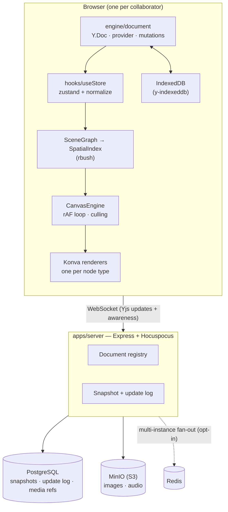

# Vega-Canva

A real-time collaborative infinite canvas. Multiple people draw, write, and talk
on one unbounded 2D surface, with CRDT sync, offline editing, client-side
physics, and true vector export.

Originally built for a Vega-IT hackathon; since substantially rebuilt.

---

## Running locally

Infrastructure (Postgres, Redis, MinIO, and the sync server) is containerised:

```bash
docker compose up -d --build     # sync server on :3000
npm install                      # once, at the repo root (npm workspaces)
npm run dev -w apps/frontend     # Vite on :5173
```

Open `http://localhost:5173`. You land on a dashboard; creating a workspace
navigates to `/room/:id`. Copy that URL into another window to collaborate.

```bash
npm test -w apps/frontend        # Vitest
npm run build -w apps/frontend   # tsc -b && vite build
npm run lint -w apps/frontend    # oxlint
```

Endpoints are derived from the host that served the page (see
`utils/endpoints.ts`), so opening a room link from another machine on the LAN
works without configuration. Override with `VITE_SERVER_HOST` / `VITE_WS_URL`
when the frontend and sync server are on different hosts.

---

## Architecture



Sync uses CRDTs (Yjs), so there is no authoritative ordering server — clients
converge without one, which is also what makes offline editing work: edits made
while disconnected merge on reconnect rather than being rejected.

### The document layer — `engine/document/`

The single owner of collaborative state. Everything else subscribes to it; it
depends on nothing above it.

| Module | Responsibility |
| --- | --- |
| `doc.ts` | `Y.Doc`, Hocuspocus provider, IndexedDB persistence, the shared maps, connection status |
| `mutations.ts` | The **only** write path. Stamps z-index, timestamps and authorship so no caller can forget them |
| `observe.ts` | The **only** observer of the objects map. Publishes a `{changed, removed}` id set |
| `normalize.ts` | Maps any persisted node — current or legacy — onto the canonical schema |
| `migrateDoc.ts` | Idempotent, transactional rewrite of a stored document to the current schema |

Two invariants worth knowing before changing anything here:

- **All writes go through `mutations.ts`.** New nodes always land on top of the
  stacking order and always carry `createdAt`/`updatedAt`/`createdBy`, because
  those are stamped centrally rather than by each tool.
- **All reads are normalized at the boundary.** `useStore` normalizes each
  changed node once, so nothing downstream ever sees a legacy field.

### The document model — `engine/model/schema.ts`

One canonical shape per node type, governed by two rules:

1. **`width`/`height` on the base node are the only source of bounds.** Nothing
   else stores a size.
2. **`geometry` is form; `appearance` is paint.** Nothing lives in both.

```ts
BaseNode      x, y, width, height, rotation, scaleX, scaleY, opacity,
              zIndex, parentId?, frameId?, locked, hidden, material?, title?,
              createdBy, createdByName?, createdByColor?, createdAt, updatedAt

TextNode      text, typography, resize, appearance?
ShapeNode     geometry{kind, points?, innerRatio?, endStart?, endEnd?, endScale?},
              appearance, text?, typography?
StickyNode    text, theme, fontSize, author, reactions, tags, pinned
PathNode      geometry{kind:'freehand'|'bezier'|'compound', …}, appearance
ImageNode     src, naturalWidth?, naturalHeight?, appearance, crop?, filters?
AudioNode     src, durationMs, waveform, author, transcript?
FrameNode     appearance, safeArea?, layout?
ConnectorNode from, to, routing, appearance?, endStart?, endEnd?, endScale?, label?
CommentNode   text, author, resolved
```

`parentId` and `frameId` answer different questions and are deliberately not
the same field: `parentId` is a synthetic id shared by the members of a group
and belonging to no node, while `frameId` names a real frame node. An object
can be in a group *and* in a frame.

`TextNode.resize` is `'width' | 'height' | 'fixed'`. It replaced `autoHeight`,
which could only express two of those three states and was read by nothing;
`SCHEMA_VERSION` is 3 so the migration deletes the old key rather than leaving
the normalizer to ignore it.

`ConnectorNode` is the one type whose geometry is **derived rather than
stored** — `from`/`to` hold node ids and a side, and the points are recomputed
on every read from wherever those objects now are.

`typography` keeps `fontWeight` and `italic`/`underline` as separate orthogonal
fields. Konva wants them combined into a single `fontStyle` string; that
translation happens in exactly one place
(`components/canvas/renderers/shared.ts`).

Documents written by older clients still render correctly — `normalize.ts`
handles them on read — and converge to the canonical shape via a one-time
migration guarded by `schemaVersion` in the document metadata.

### Rendering — `components/canvas/`

`ObjectRenderer` owns what is shared across every node type: transform,
selection, dragging, editing lifecycle, presence. Drawing dispatches to a typed
per-type renderer. Objects rotate and scale about their centre, so the group sits
at the centre with its contents offset back — which means `e.target.x()` during a
drag reports the centre, exactly what the physics body expects.

- **One shared `<Transformer>`** (`SelectionTransformer`), re-pointed at the
  current selection rather than one mounted per object.
- **One shared `NodeEditor`** serves text, shape labels, stickies and comments.
  It positions itself in screen space from the camera rather than through Konva's
  transform tree, which is what keeps the caret glued to the object through pan
  and zoom.
- **The transformer drives a proxy, not the object.** Konva resizes by writing
  `scaleX`/`scaleY`, which is the wrong verb for nearly every node here: a scaled
  sticky has scaled padding and blurred type, a scaled path has a scaled stroke.
  So the `Transformer` is attached to an invisible `Rect` and the real objects
  render at a *size*, never a scale. The gesture writes to `liveTransformStore`,
  a transient per-node store outside React, and each renderer merges that live
  size into the node it draws — which is what makes a shape fill its box as you
  drag any vertex, instead of sticking to the top-left until you let go. During a
  gesture **the document is stale on purpose**; anything that needs current
  geometry (the selection box, the contextual rail) reads the live store first
  and the document second.

### Where a floating panel goes — `engine/interaction/railPlacement.ts`

The contextual rail over a selection is placed by a pure function of the
selection's rotated hull, the rail's measured size, the window, a per-side
standoff, and where it sat last time. It prefers above, then below, then the
sides, then the wall. It inflates the hull by the reach of the resize handles so
it never lands on one. It ramps the clearance up for a thin subject, because a
single-line text object is shorter than the rail is tall and "below" would
otherwise mean "across". And it keeps its last side through 24px of movement, so
the rail does not flap while an object is nudged.

All of which is testable without a browser, and 23 tests cover it — which is
what made the actual bug embarrassing. Three rounds of "more clearance below,
please" went into tuning the standoff. The tell was the user's: *the top has
enough room, so why is the bottom having these issues?* Symmetric geometry
cannot produce an asymmetric error. The rail was converting world coordinates to
**stage** coordinates and then positioning a DOM element in **window**
coordinates, omitting the stage's own origin — which is inset by the 28px ruler.
Exactly 28px of surplus air above, and 28px of deficit below. Three named
spaces; convert once, at a boundary you can point at.

**Staying visible is a separate problem from being placed well**, and it had two
causes with one symptom: the rail disappears, and only a page reload brings it
back.

A gesture hides the rail, because it anchors to committed bounds and nobody
reaches for a toolbar mid-drag. That was a single boolean flipped by two `window`
events dispatched from six places — object drags, the transformer, the line and
connector handle editors, the corner-radius handle, and the text editor's mount
and unmount. Six senders and one boolean means the rail stays hidden forever if
any one of them sends a start without its end, and they can: **Konva does not
fire `dragend` for a node destroyed mid-drag**, and every one of those handles is
conditionally rendered, so a selection change during a handle drag ends the
gesture with no event. A missing `end` is not a bug you can finish finding — it
is a shape, and there is always one more path that skips it. So `railVeil` makes
the state *falsifiable* rather than merely paired: a pointer release, with
nothing being typed into, cannot have a gesture behind it. That is a fact about
the world rather than a promise from a sender, and it cannot be forgotten by a
component that unmounted.

The second cause needs no missing event at all. The rail writes its position
straight to the DOM each frame and skips the write when the rounded coordinate
has not changed — but it unmounts whenever it is veiled, and **the replacement
element has no transform of its own**. Hiding and showing it at the *same*
coordinates was therefore skipped as "no change" and left it at the origin,
translated off screen by its own centring. Editing a text object does exactly
that: the veil goes up, the object does not move, and the rail comes back
invisible. The guard now remembers which element it wrote to, so every mount
writes its first frame whatever the arithmetic says — and the rAF loop books its
next frame before doing the work, so one throw cannot end the only thing that
brings the rail back.

### Performance

Built around the assumption that the document is large and the viewport is small.

- **Spatial culling.** `SceneGraph` maintains bounds (rotation included);
  `SpatialIndex` is an R-tree; `CanvasEngine` queries it once per frame with a
  300px overscan and publishes a visible-id set. A 500-object query measures
  ~0.004ms.
- **Per-object subscriptions.** Each renderer subscribes to its own node, so
  moving one object re-renders one object.
- **Virtualized Layers panel** (`useVirtualRows`) — a DOM row per object is by
  far the most expensive consumer of document changes at scale.
- **Camera applied outside React.** The rAF loop writes stage position and scale
  imperatively; panning and zooming do not re-render the tree.
- **Awareness-driven physics.** In-flight objects are broadcast over awareness and
  read through one shared subscription, never per-object polling.

Measured on a 500-object scene: **~5.7ms** to commit a single object move.

### Physics — `engine/physics/simulation.ts`

The simulation is a plain module: node data in, transforms out. It imports
Matter and the material profiles and **nothing else** — no React, no Konva, no
Yjs, no awareness — so it runs in Node with no canvas and is covered by tests.
`hooks/usePhysics.ts` is only the adapter: it decides when to step, writes
in-flight poses straight to Konva, commits settled ones to the CRDT in a single
transaction, and arbitrates ownership.

**Single-writer ownership**: every client runs its own world, so exactly one
client owns an object while it is in motion. The owner simulates and commits the
final position; everyone else renders the owner's broadcast flight path. Without
that, two clients settle the same object at slightly different resting positions
and fight over the write.

Objects collide, and being hit promotes a resting object to a moving one — a
static body in Matter has infinite mass, so without that it behaves as a wall.

**Force is a mode, not an ambient setting.** Picking a force tool (Pull, Push,
Drop, Wind, Shockwave) turns force on by itself and shows a field ring at the
radius the simulation will actually use. Entering the mode snapshots the layout,
so "Restore layout" can undo the whole session in one action. The header switch
governs only whether a flick throws.

There is deliberately **no world gravity**: an infinite canvas has no floor, so a
constant field would pull content off the board forever and nothing would ever
settle. "Drop" is a force you aim and hold. `engine/physics/forces.ts` records
the full reasoning.

Every object has a **material** — Feather, Paper, Rubber, Wood or Stone — chosen
in the Properties panel, deciding how far it carries and how hard it bounces.

### Diagrams as code — `engine/diagram/`

Mermaid flowcharts in and out. The text is parsed into the canvas's own
vocabulary — shapes and connectors — rather than handed to the `mermaid`
package, which renders an SVG. That matters: an SVG is one opaque picture on a
canvas whose entire point is that everything on it is editable, and it is also
why the dependency is not worth over a megabyte.

| Module | Responsibility |
| --- | --- |
| `mermaid.ts` | The parser and the emitter. Bracket shapes, both edge-label syntaxes, `style`/`classDef` directives. Pure. |
| `layout.ts` | Layered (Sugiyama) placement — cycles broken first, then longest-path ranking, then barycentre ordering. Pure. |
| `build.ts` | Graph to canvas nodes, and any selection back to source. |

Connectors store the **ids** of what they join and recompute their route on
every read, so a generated diagram survives being rearranged by hand — drag a
box and the arrows follow, because they were never told where it was.

### Text — `engine/text/`

Text is laid out before it is drawn, rather than handed whole to one
`Konva.Text`. `layout.ts` produces positioned line boxes — wrapping, tracking,
leading, paragraph spacing, alignment, ellipsis — from an injected measurer, so
every rule in it runs under test without a canvas. The line boxes are what made
four separate features possible at once: paragraph spacing, the per-line
highlight ribbon, honest vertical alignment, and putting the caret where you
clicked.

**Convert to path traces the real letterforms.** Right-click a text object and
"Convert to path" replaces it with a vector outline whose points you can push
around — what Figma and Illustrator call outlining type. That runs down a
*second* font path, deliberately separate from the first: layout measures with a
Konva probe, because the only thing that knows how Konva wraps a line is Konva,
while outlining needs glyph contours, which only the font file has.
`fontBinary.ts` fetches the woff2 Google is already serving and parses it with
`fontkit` — imported lazily, and given its own Vite chunk, because it drags a
brotli decoder in with it. `glyphOutline.ts` turns pen commands into our bezier
geometry, flipping the y axis and promoting quadratics by the two-thirds rule.

The division of labour is the load-bearing part: **the app decides where the
lines break, the font decides how wide each glyph is.** Handing the paragraph to
the font would move the words at the moment of conversion, and outlining is
meant to change the representation, not the appearance — so `layoutText` still
produces the lines and `font.layout` is asked only for advances within one.
Decorations that are not letterforms — underline, highlight, glow, list bullets
— cannot survive as contours. They are dropped, and the toast names which ones,
because silently losing a highlight is worse than refusing to.

### Export — `engine/export/`

A registry of exporters behind one service. All three formats frame the
**document bounds**, computed by a shared helper, so they agree with each other
regardless of where the camera happens to be.

- **PNG** — reframes the Konva stage onto the content box, captures, restores.
  Clamped to a maximum canvas edge. Audio players are DOM overlays and are
  therefore absent.
- **SVG** — serializes CRDT state to real vector primitives, escaping user text.
  Audio becomes a labelled placeholder; comment pins are excluded, as in Figma
  and Illustrator.
- **JSON** — canonical node data plus comment threads.

**A copy contains what the menu says it contains.** `Copy as PNG` and `Copy as
SVG`, run on the same selection, used to produce different pictures. Both vector
exporters filter the document by `selectedIds`; the raster path passed the same
ids to `computeContentBounds` — so it *framed* to the selection — and then
captured the live stage inside that frame, with everything else still on it. The
SVG had the one sticky note; the PNG had the note, the frame behind it, and the
corners of the two notes overlapping it. One request, two answers, and the only
way to find out which you had was to open the file. `isolate.ts` hides everything
outside the set for the length of the capture.

The whole-board PNG had the same disagreement from the other end. **The canvas
culls to the viewport**, and a capture reframes the stage imperatively, which
gives React no chance to mount anything — so a board wider than the window
exported at the right dimensions with the off-screen half blank, while its SVG
had all of it. `renderScope` lets an export declare what it needs mounted and
`Canvas` unions that in, which is the rule already there for the selection,
generalised. Mounting is the asynchronous half and capturing stays the
synchronous one, so the engine's own rAF loop still cannot re-apply the live
camera mid-capture.

That opens a quieter gap in turn: a freshly mounted image is an empty rectangle
until it loads, which reads far more like a deliberate blank than a missing
object does. `imagesReady` counts what the document says should be drawable
against what the stage can draw — the only way to see the gap *before*
`use-image` has produced an element to listen to — and waits, with a deadline,
because a hung export button is less visible than a missing picture.

**Density follows the subject.** A copy used to take the exporter's default of
2×, which is right for exactly one subject size: a 180-unit sticky note arrived
in a document as a 360px image, and a large board asked for 8000px and was
silently clamped. `clipboardScale` holds the *result* steady instead, aiming the
long edge at 1600px within a 1×–4× band, and still defers to `fitScale` for what
the browser will actually render.

**And a copy now reports.** Four ordinary failures — an insecure context, a
browser with no `ClipboardItem`, a denied permission, a render that threw — used
to close the menu having done nothing, so the next Ctrl+V produced whatever had
been on the clipboard beforehand: a failure that surfaces somewhere else
entirely, as the wrong thing in someone's document. SVG also goes on as vector
*and* text rather than text alone, so pasting into Illustrator gives shapes
rather than a paragraph beginning `<svg`.

**Exporting a selection.** Six formats, four densities, a background and a live
preview already worked on a subset of the document; there was no way to say
"this" from the canvas. Right-click, Ctrl+Shift+E, or the dialog's own Region
list. `exportScope` answers "what does this cover, and what is it called" once —
for the menu label, the toast and the filename as well as for the file — so
"Copy board as PNG" cannot appear over a copy of three objects. It expands a
selected frame to its contents, the same reading `resolveExportTarget` already
took for the per-frame option, and drops ids whose objects a collaborator has
deleted.

### Collaboration surfaces

Cursors, selection outlines, the viewport radar, per-object "editing" badges and
emoji gestures all ride on Yjs awareness rather than the document, so ephemeral
state never enters history.

**One writer, one reader.** `PresenceManager` is the only thing that writes
local awareness state: it owns one throttle (15Hz) and the idle timer, and
everything ephemeral goes through it. Having two writers for `cursor` is what
left ghost pointers parked on the canvas after someone moved to a side panel,
and having two for `viewport` meant a single pan broadcast an update on every
frame to every peer.

`engine/presence/collaboratorStore.ts` is the mirror image: the only thing that
*reads* other people's state. It normalizes awareness into a `Collaborator[]`
and runs **one** frame loop that every presence surface subscribes to. There
used to be four independent readers with four different answers — and the frame
loop belonged to the radar, so collapsing the radar froze the interpolation the
cursors depended on.

It publishes two kinds of change, deliberately kept apart:

- **Roster changes** — joins, leaves, renames, going idle, crossing on or off
  the canvas — go to React through `useCollaborators()`. A few times a minute.
- **Positions** are read inside the frame loop and written straight to the DOM.
  Re-rendering a component tree at broadcast rate to move a 22px arrow is how a
  presence layer starts costing more than the document it decorates.

**Cursor and viewport answer different questions.** The cursor is where a
pointer is right now, and it is cleared the moment that pointer leaves the
canvas. The viewport is where someone is *working*, and it persists while they
read, think, or use a panel — so it, not the cursor, is what keeps a
collaborator on the radar and in "Jump to…".

`ViewportState` stores the **top-left corner** of what someone can see, in world
coordinates, plus the viewport in screen pixels. The minimap wants that corner
because it draws a rectangle; everything that navigates *to* a person wants the
middle instead, via `viewportCenter()`.

Authorship is denormalized onto each node at creation, so a node still shows who
made it after that person disconnects.

### Cursors — `engine/cursor/`

Two different problems, deliberately solved two different ways.

**Your own pointer is drawn by the app**, over the canvas only. Tools resolve
to a *cursor mode* (`cursorModeForTool`, pure and tested), and `LocalCursor`
renders the matching art from `cursorArt.tsx`: a solid pointer with a small
tool badge in its tail, or a crosshair where the job is to hit a point rather
than indicate a direction. Tools swap instantly — no tweening, no press
response.

Two things make this work where the version it replaces did not:

- **The transform is written inside the pointer event, never in a frame.** The
  old implementation stored a coordinate and applied it in `requestAnimationFrame`,
  so it was a frame behind by construction. It also subscribes to
  `pointerrawupdate` where that exists, which is not coalesced, so a
  high-polling mouse lands on positions `pointermove` never reports.
- **The art has fixed colours, not theme tokens.** A cursor sits over
  *content*, not over the background: a `--surface-primary` fill is invisible
  against a dark canvas and against any dark object in a light one. White fill,
  near-black outline, offset shadow — legible over everything.

Panels and chrome keep the real OS pointer. `index.css` also keeps a full set
of native `[data-cursor-mode]` cursors underneath, and `LocalCursor` hands the
surface back to them on a coarse pointer or under `forced-colors`, where a
drawn cursor cannot honour the pointer size and contrast the OS was asked for.

**The attribute that suppresses the native cursor is applied only while the
drawn one is actually visible**, so the canvas is never left with `cursor:
none` and nothing on top of it. Setting it at mount time instead is subtly
broken, because no `pointerenter` is delivered for a pointer that was already
inside the element: mounting with the mouse over the canvas — which is what
every reload and every sign-in does — hid the system cursor and drew nothing.

**Other people's pointers** are rendered by `RemoteCursors`: React mounts and
unmounts them and decides whether each is visible, while a frame loop does
position and interpolation only. Splitting it that way is deliberate — when the
frame loop also owned visibility, a throttled tab showed an empty room.

**Other people's pointers are content**, so they keep custom rendering.
`RemoteCursors` mounts and unmounts through React and moves through the shared
presence frame loop, writing transforms straight to the DOM rather than
re-rendering at broadcast rate. Three things there are arithmetic, and
therefore live in `remoteCursor.ts` under test:

- **Interpolation is frame-rate independent, and happens in world space.** The
  old fixed per-frame lerp made a 144Hz display converge nearly 2.5× faster
  than a 60Hz one on identical network updates; smoothing *screen* positions
  additionally meant that panning your own canvas dragged everybody else's
  pointer along a fifth of a second behind the content it was sitting on.
- **Name chips derive their colours.** A chip painted in the raw presence
  colour with white text failed WCAG AA on half the palette — Amber `#F59E0B`
  at about 2:1 — and sign-in lets people pick an arbitrary colour, so a lookup
  table would not have covered it. `chipColorsFor` moves the fill the *shorter*
  way to readability, so deep colours stay saturated with white text and bright
  ones stay bright with hue-tinted dark text. The arrow always keeps the raw
  colour and the chip is ringed in it — which is also what separates a deepened
  chip from a dark canvas, since solving text-on-chip contrast can take a deep
  colour very close to black.
- **Chips flip at the viewport edge** instead of being clipped by the overlay,
  and are dropped entirely once the pointer itself is off screen — the clamp
  that rescues a chip near an edge otherwise strands a lone name in the corner
  with no arrow attached to it.

A name fades out after six seconds of stillness and the arrow stays, unless
the person is mid-task — six people in a room is otherwise six permanent name
tags over the work.

### What you see while someone else works

One channel per question, and no surface exists twice.

| Question | Answer |
| --- | --- |
| Where is Mike? | his arrow, in his colour |
| What is he holding? | a **tool badge in the arrow's tail** |
| What is he doing that I can't see? | one word beside his name |
| Which object is his? | a name tag on the selection outline |
| Is anyone busy off-screen? | the radar's ping, and the edge marker |

**The badge is the load-bearing idea.** Your own pointer already wears a small
glyph for the tool in your hand (`cursorArt.tsx`); a collaborator's pointer
wears *the same glyph* in their colour. Nothing has to be learned twice, no
legend is needed, and it costs no screen space — the badge sits in the arrow's
tail where there was nothing. It also needed no new data: `tool` has always
been published by `presenceManager.updateTool` and had never been read.

The glyphs are drawn into a 9px disc at a heavy stroke weight, so they must be
**two or three strokes with no small features**. A lucide-weight pencil became
a diagonal slash inside a circle — which reads as a prohibition sign — and an
outlined hand became a blob. Both were caught by rendering the whole set at 4×
and looking at it, and the rule is written into `TOOL_GLYPHS`.

Two deliberate blanks: **select and pan carry no badge.** Selecting is the
default state, so badging it decorates every pointer in the room with nothing;
panning changes only what *that person* can see, so there is no outcome for
anyone else to anticipate.

**Activities are a closed set** — `typing`, `recording`, `drawing`, `moving` —
and only the first two get a word next to a name. Recording is invisible, and
typing nearly so. Drawing and moving are already fully visible: the stroke is
appearing, the object is sliding. Labelling those writes on screen what the
screen has already said. They still travel, because they hold the name chip up
while someone works and they drive the radar's ping.

This replaced a free-text field written in two places as `'✏️ Typing'` and
`'🎤 Recording'` — an icon, a word and a state fused into one value that went
on the wire and was rendered verbatim, so it could not be styled, translated
or tested.

### Off-screen collaborators — `components/PresenceEdgeMarkers.tsx`

On an infinite canvas, two people who have panned apart have no way of knowing
the other is there. A marker rides the edge you would leave by: their initials
in their own colour, on a pill in the inverse of the page surface so it reads
as chrome over the board rather than as another object on it, with a chevron
pointing their way. Clicking it flies to them.

**Hovering expands the pill** to show their name and how far away they are,
rather than opening a tooltip beneath it. One surface that grows is one object;
an avatar plus a floating tooltip is two, and the tooltip lands off-screen at
exactly the edge the marker is pinned to. For the same reason the label grows
*inwards* when the marker is near the right-hand edge (`data-flip`).

- It walks the **ray** from the middle of the screen and takes where it crosses
  the edge. Clamping each axis independently instead — which is what the
  version this replaces did — lands everything diagonal in the same corner, so
  three people in three directions stack up and none of the arrows point at
  anyone.
- The edge it uses is the edge of the **visible canvas**, measured from the
  DOM, not the window: the right-hand edge is exactly where the Properties
  panel is, so markers placed against the window went behind it.
- A marker is suppressed only while that person's **pointer** is on screen —
  that is when `RemoteCursors` is drawing them and a marker would contradict
  what you can see. Otherwise the marker *is* how they are represented, and it
  follows them onto the screen rather than vanishing: at the edge with a
  chevron while they are off it, at the middle of their view with the chevron
  dropped once they are on it.

That last rule matters more than it looks. **A cursor is cleared the moment
someone's pointer leaves their own canvas** — a panel, another window, another
app — which is correct, because a stale arrow parked on the board is worse than
no arrow. But it means a collaborator who is present and simply not pointing
has no cursor to draw, and hiding the marker as soon as their viewport came on
screen meant that following an arrow to someone and arriving showed you nothing
at all.

It also means **you cannot see a remote cursor while testing alone with two
windows**: your pointer is in one of them, so the other one has correctly
published `cursor: null`. The avatar marker is what you will see instead, and
that is the system working.

### Radar — `components/Minimap.tsx`, `engine/presence/RadarEngine.ts`

The whole board at a glance, with everyone on it: objects in their own colours,
each collaborator as a dot with their viewport rectangle, an ambient ping while
they are active, and your own viewport as a draggable frame. Drag to scrub the
camera, click someone to fly to them, and the zoom control is here too — until
now nothing in the app displayed the zoom level at all.

The framing is the part that matters, and it is pure and tested
(`radarProjection.ts`). The radar holds its frame until content actually falls
outside it or the frame has become much larger than it needs to be, then eases
to the new one. Re-fitting every frame — which the previous implementation did
— means that panning, since your own viewport is part of the bounds, rescales
the map continuously and objects that have not moved appear to swim.

**The people list was starving the map.** The panel is a fixed height with the
map on `flex: 1`, so every row of collaborators came straight out of the map's
share — three people and the board was a sliver, while the rows themselves were
20px avatars with 11px names. Both halves were illegible at once. The panel is
taller now, the map has a floor it cannot be pushed below, and a row is 26px
avatar with the name and what they are doing on **two lines** rather than
competing for one — at this width a name and a status side by side left about
six characters for the name.

The follow control also stopped shouting. It sat on every row wearing a
crossed-out eye — this app's glyph for *hidden* — so a room of four showed four
"hidden" marks and the one row that mattered had to be found among them. It is
revealed on hover now, and stays lit on the row it is on, because "which of
these am I tied to" is a question only the row can answer. That the mode exists
at all is already said by `FollowIndicator` at the top of the screen; a second
copy in the radar was written and then deleted, because two statements of one
fact four inches apart have to be kept in step and one of them will not be.

### Sticky notes

**A new note opens ready to type in**, and Escape backs out of it — an empty
note removes itself rather than leaving a coloured square that looks like
content. `Tab` chains another note beside it, so a run of ideas costs one
keystroke each.

That flow rests on a **latch, not an event**
(`engine/interaction/pendingEdit.ts`). Creating the node and then dispatching
"now edit it" is a race the tool always loses: the renderer has not mounted,
so nothing is listening. The tool claims the id first and the renderer picks it
up during its own first render, which has no window to miss.

**The type is fitted to the note, not stored.** A fixed size meant Konva
clipped anything past the bottom edge — typing past the fold made your own
words invisible, in silence. The canvas and the editor overlay both go through
`stickyFit`, which measures with a Konva probe, because the only thing that
knows how Konva wraps a line is Konva; two "close enough" implementations make
the words reflow under the caret. Height alone is not a sufficient test —
a lone long word fits by height at a large size because the renderer
hard-breaks it, so "Onboarding" rendered as "Onboar / ding".

**One derivation of the text box.** `stickyFooter.textBox` is the only thing
that decides where a note's words go. It exists because the fitter and the
`<Text>` that draws the result used to compute that box separately, from the
same fields, and disagreed about whether there was a footer at all. The footer
band is now reserved *always*, not only on a note somebody has reacted to —
otherwise the first reaction made the handwriting smaller: the box lost eight
pixels, the fitter found a size a step down, and every line re-wrapped and
re-centred. A note's text must not resize because somebody liked it.

Everything in that band shares one height and therefore one centreline. The
author's dot and initials had their own offsets and rode about five pixels above
the row they belonged to — close enough to read as a mistake rather than a
decision, which is what it was. The author's width is measured from the initials
rather than fixed at "a dot and two letters", so `MWM` does not get the first
reaction chip parked on top of it.

**Pinning holds the note still.** The pin had been a drawn icon with nothing
behind it. It is now a control: a hit target larger than the glyph, a tooltip
that counter-rotates with the note, and the one thing its name promises — a
pinned note is not draggable.

### Voice notes — `AudioTool`, `AudioRenderer`, `engine/model/audioPlayback.ts`

Record by picking the mic and clicking the board; the note lands where you
started talking, not where the pointer ended up. Escape or Discard throws the
take away, and a five-minute cap stops an unattended recording holding the
microphone open. A refused or missing microphone says so — it used to fail into
`console.error`, which from the user's side is a click that does nothing.

**The waveform is the scrubber**, not decoration: drag it, or use arrows,
Home/End and Space, because it is a real `role="slider"`. Playback speed cycles
1× / 1.5× / 2×. Only one note plays at a time. Duration is taken from the audio
element rather than the document, since uploaded clips are stored with
`durationMs: 0` and showed `0:00 / 0:00` while plainly playing; the first client
to load one writes the real value back.

The player is a DOM overlay, which has one consequence worth knowing: the node
needs a **`Rect` with a fill** underneath it purely to exist in Konva's hit
graph, and the card itself is **`pointer-events: none`** with only its controls
opting back in. Without both, a voice note cannot be selected or dragged —
every other object type has real Konva shapes and never shows the problem.

### Tags — `engine/model/tags.ts`, `tagFilter.ts`

Sticky tags, normalised so "Needs Design" and "needs-design" are one tag, with
a filter in the Layers panel. They shipped together deliberately: a tag with no
way to act on it is decoration, which is what the field had been for the whole
life of the project.

Selecting tags matches **any** of them — an all-of filter over hand-typed tags
returns nothing almost every time — and the canvas **dims** non-matching notes
rather than hiding them, because seeing the matches among their neighbours is
the reason to filter on a canvas rather than in a list. The filter lives outside
the document and is not persisted: it is a way of looking, not a property of
the board, so it must not empty anyone else's screen or outlive the session.

### Sticky reactions — `engine/document/reactions.ts`

The one node field stored as a nested CRDT type rather than a plain value, and
the reason is worth knowing before touching it.

Every other field — position, text, colour — is edited by one person at a time,
so a plain value with last-write-wins is correct and simplest. Reactions are
the opposite: they are *designed* to be written by several people in the same
instant. Stored as `emoji → count` and incremented on click, two people
reacting simultaneously both read the same number, both wrote number + 1, and
one reaction silently disappeared.

They are a single flat `Y.Array` of `emoji\0authorId` entries, created with the
node. The obvious shape — `Y.Map<emoji, Y.Array<authorId>>` — is a trap:
**concurrent `set` on the same key is last-write-wins**, so any container
created on demand can be created twice and one copy, reaction included, is
thrown away. That bites when two people react to a new note, and again when two
people react with the same new emoji to any note. One flat array has exactly
one container, created once, and everything after that is an insert or delete
that merges.

Because reactions record *who*, a reaction is a toggle: clicking your own emoji
again removes it, and nobody can clear anyone else's.

Along the bottom of the note, `layoutFooter` decides which chips fit: left to
right, in the order they were made, and a chip is placed only if the overflow
badge that may follow it also fits — otherwise the last chip takes the badge's
room and the badge lands off the note. The final chip is the exception, since
nothing can overflow behind it. Chips that do not fit are never reordered around
ones that do; the same note showing its reactions in a different order at a
different width is worse than a `+2`. That badge opens, so what overflowed is
reachable rather than merely counted.

### Comments — `engine/comments/`, `components/comments/`

Threads pinned to a point or to an object, with replies, author-only editing,
resolve, mentions, per-person unread state and an inbox. Threads live in their
own `Y.Map` (`commentsMap`), separate from the objects map — a comment is not a
thing on the canvas, and mixing them would put every reply into the scene
graph.

**Identity is the persisted user id, not the session's client id.** This is the
whole feature working or not: edit and delete are author-only and compare
against it, and `awareness.clientID` is re-minted on every reload, so a reload
used to make your own comments permanently read-only to you — and because
client ids are random, a later visitor could inherit edit rights over someone
else's words.

**Read state is per person and deliberately not in the document.** It lives in
`localStorage` keyed by room. In the CRDT it would mean your colleague opening
a thread marks it read for you, and it would grow the update log with data
nobody else can use. It is the one piece of comment state allowed to be lossy:
losing it shows a few threads as new again, which beats every alternative.

**A mention is stored as `@[Display Name](authorId)`.** The position is part of
the meaning, so the id travels inline rather than only in a side array, and the
display name is captured at write time and never re-resolved — silently
rewriting a year-old message because someone changed their profile is editing
history. Each message also carries a denormalised `mentions` array, because
"does anything unread name me" runs over every message of every thread on each
render of both the pins and the inbox.

The inbox exists because on an infinite canvas a comment you have not scrolled
to does not exist. Its order is fixed and not configurable, because there is a
right answer: threads that name you, then unread, then by recency, then
resolved.

An open thread is **portaled above the chrome**. The comments overlay sits
inside the canvas beneath both side panels and clips to its own bounds, so a
thread near either edge rendered underneath a panel and could not be read or
typed into. Pins stay in the overlay; only the focused surface floats.

### Lines — `engine/model/polyline.ts`, `lineEnds.ts`

A line was exactly two points with an optional *profile* between them — wavy,
zigzag, coil. That covers "an arrow from this box to that one" and nothing else:
the moment a line has to turn a corner or trace a route, two points is not a
limitation you work around, it is a different tool, and people drew two lines
and lined them up by eye.

A line now stores a **run of vertices**. Drag the tool for the straight
two-point line; click once per corner for a route, and Enter or Escape to
finish. The two gestures need no mode and no modifier because the pointer has
already said which is which: a drag is a press and a move, a click is a press
and a release in one place.

Double-click a line, or press Enter, to open its **point editor** — every vertex
draggable, Alt-click a segment to add one, Delete to remove one, and a curve
handle on every segment. The handle is the point the curve actually passes
through, not the Bézier's control point, which sits twice as far out and would
therefore never be under the pointer dragging it.

**A bend is stored in its chord's own frame** — how far along, how far across,
both as fractions of the chord's length. Absolute coordinates would leave the
curve behind when either endpoint moved, and dragging a corner would slew the
curve sideways instead of carrying it along. It is also why a resize needs to do
nothing to them at all: a fraction of a chord survives its chord being scaled.

**Rounding the corners is a different thing from bending the segments**, and the
first attempt got that wrong. Bowing a segment bends its *middle* and leaves its
ends where they were, so a run came out curvy with every sharp turn intact
between two arcs. Rounding means the run arrives at a point and leaves it along
one shared direction — and no arrangement of per-segment quadratics can promise
that: for a run that turns back on itself there is no solution at all, and a
symmetric zigzag is the counterexample. So `smooth` is a flag, and the renderer
draws a **centripetal Catmull-Rom spline** through the same points; centripetal
rather than uniform because uniform ties a knot at a hairpin, which a hand-drawn
route reliably contains. The two are alternatives rather than layers — the
editor withdraws the curve handles while a line is smooth, and the bends sit
underneath untouched, so turning it off gives back exactly the shape that was
there.

Three storage forms now exist and all three are legitimate: the run, the
two-point pair, and the legacy corner-to-corner box that every line drawn before
any of this still uses. **One reader answers all three** — so the renderer, the
outline, the exporter, the thumbnail and the editor cannot disagree about where
a line goes.

Two bugs surfaced while auditing the rest of it. A line caught in a
multi-object resize kept its old endpoints while its box grew: everything else
in the selection scaled and the line stayed exactly as long as it was.
`fitPathToBox` had done this for paths since the transform rewrite, and a line
stores its shape the same way. And swapping a shape's kind spread the old
geometry, so a rectangle made from an arrow carried the arrow's endpoints,
profile and caps — invisible until you swapped back, when the line reappeared
somewhere it had never been.

**The profiles were measured rather than eyeballed.** A wavy line's target
period was 36 units, so a 600-unit line came out with seventeen repeats at an
amplitude of eight — a texture applied to a straight line. Amplitude is a
fraction of the period, so a tight period is a shallow one too: one number
caused both faults, and 72 was chosen by drawing at 600 and comparing. The coil
moved onto the same figure — ten loops read as a row of small curls competing
with each other, seven are large enough to be a coil — which also gives the
three a shared rhythm.

**And they arrive along their own axis now.** Measured on a 400-unit line, the
angle each profile's last segment made with its axis: curved ±20.6°, wavy 55.2°,
zigzag 43.8°, coil 0°. A sine crosses its axis at the *steepest* part of the
wave, so a wavy line left and arrived fifty-five degrees off the direction it
was going — which gave an end cap two bad options and no good one. Point it
along the run and it sits crooked against the stroke reaching it; point it along
the stroke and it aims fifty-five degrees away from where the line goes. Both
readings are wrong, which is how you know the marker was never the problem.

The first attempt *was* to fix the marker, and it produced the second of those
two faults. The fix is the geometry: a zigzag gets a short flat lead at each
end, and a wave's amplitude is taken to zero over half a period, so the tangent
at each endpoint is the axis — `y' = A'·sin + A·ω·cos`, and both terms vanish
when `A` and `sin` do. The coil has always been drawn this way, which is why it
was the only profile whose arrowheads looked right. Measured after: zigzag and
coil at 0.00°, wavy at 6°, and the special case in the cap code deleted, because
the last segment is now the right answer for every run. An arc keeps its ±20.6°,
because that *is* the arc.

### The hand-drawn look — `engine/model/rough.ts`

Seeded, pure, and shared between the canvas and the exporter, so the strokes in
an exported file are *the same strokes* rather than another draw from the same
distribution. Three levels that differ in **character** — how many passes, how
far an edge bellies, how far a stroke runs past its corner — because scaling one
displacement is the axis that does not produce three usable looks.

**Shading gained the two things a hand varies and this could not.** The gap
between strokes and the angle they run at were both single constants, so every
hachured shape on a board carried the same weight of grey and ran the same way.
Density is what pen shading is *for*: a drawing tells a light surface from a dark
one by how densely it is hatched, and with one gap the style could draw the
texture and not the value. And a shared angle means two hatched shapes laid over
each other shade in lockstep, so the pair reads as one continuous field rather
than two objects — turning one of them is how a drawing separates them.

Three density steps rather than a slider, for the same reason the levels are
three: below about four units the strokes merge into a flat tone and the drawn
quality is lost, above about sixteen they read as stripes. Stipple had to be
fixed to take part at all — it computed its own spacing from the shape's
diagonal and discarded the gap it was handed, which made the one style whose
whole language is density the one style that had none.

**An inner shadow works on a sketch now**, and did not before: the renderer's
sketch branch returns before its effects, so the control was offered on every
sketched shape and honoured on none of them. It clips to the **drawn
silhouette**, not the geometric outline — clip it to the true rectangle and the
shadow's edge is a ruled edge, quietly redrawing the crisp shape the sketch was
there to replace. Where there is no interior — hachure, cross-hatch, scribble,
stipple — the control is withdrawn with the reason, because the marks *are* the
fill and there is nothing for a shadow to fall across.

### Colour — `engine/model/colorRamp.ts`

Every picker offered two things: a fixed set of swatches, and a saturation-value
field. Between them sits the question people actually arrive with — *this
colour, but lighter* — and neither answers it. A derived ramp does, and does it
consistently: the third step of a blue and the third step of a red are the same
distance from their parents, which is the difference between a palette and a
pile. The ramp walks value and saturation together, because lightening by value
alone runs to white through a chalky middle, and holds hue exactly, because a
ramp that drifts hue is not a ramp of *this* colour.

Where the colour sits in its own ramp is the part that was wrong. The docstring
had always said "wherever its lightness puts it"; the code placed it dead
centre, four tints above and four shades below, whatever colour it was — a
declared behaviour nothing implemented. For most colours that is invisible.
White has no room above it, so its four tints were four more whites, and the
picker keyed its swatches by colour, so React collapsed the duplicates and the
row visibly lost half its steps. Approaching either end compressed the same way
a little more each time, which is what "starts to look broken" looks like.

The base index now comes from **HSL lightness**, `v · (1 − s/2)` — value alone
calls `#2563EB` light at 0.92, and it is plainly a mid-tone — and each half
spreads across the room that actually exists on its side, so no two steps are
the same at any input. The swatches are keyed by position, because a ramp is a
list of slots and two slots holding one hex is a rendering question, not an
identity one.

### Design system — `index.css`

Two token layers, and only two: **primitives** (raw values, no meaning) and
**semantic roles** (what the UI references). Components reference semantic tokens
only. Includes a type scale, space scale, radius scale, elevation ramp, one global
`:focus-visible` ring, and `prefers-reduced-motion` handling.

All six text roles meet WCAG AA contrast in both themes. The theme follows the OS
preference until the user chooses, then persists.

---

## Repository layout

```text
apps/
  frontend/
    src/
      engine/
        document/    CRDT ownership, mutations, normalization, migration
        model/       the canonical schema
        objects/     per-type capability registry (drives the inspector)
        tools/       tool implementations behind one interface
        export/      exporter registry
        presence/    awareness state: one writer, one reader, one frame loop
                     + the radar's projection and painter
        diagram/     Mermaid in and out — parser, layered layout, builder
        text/        layout, measurement, the highlight ribbon, demo copy,
                     and the second font path: glyph outlines for convert-to-path
        physics/     the simulation, force specs, shared in-flight state
        history/     session timeline for Time Travel
        interaction/ snapping and guides, alt-duplicate, floating-panel
                     placement, and the transient stores (crop, path edit,
                     boolean preview) that must not reach the document
        cursor/      tool cursor modes, remote cursor rendering
      components/
        canvas/      renderers, node editor, shared transformer
        workspace/   header, tool dock, presence avatars
        ui/          primitives (Switch, NumberStepper, colour picker, …)
      hooks/         store, sync binding, breakpoints, focus trap, virtualization
      utils/         spatial layout, offline media queue, endpoints, materials
  server/
    src/             Express + Hocuspocus, S3 uploads, snapshots, retention
docs/                architecture notes, data model, PRD, build plan
```

## Tech stack

**Frontend** — React 19, Vite, react-konva, Yjs, Matter.js, zustand, rbush,
perfect-freehand, polygon-clipping, fontkit, framer-motion, Vitest
**Backend** — Node, Express, Hocuspocus, `ws`
**Infrastructure** — PostgreSQL, MinIO, Redis (opt-in), Docker Compose

## Notes and known limits

- **Authentication is a display identity, not an account.** A name plus a
  deterministic presence colour, stored locally. There is no server-side account
  system, and the app does not pretend otherwise.
- **Anyone with a room link can edit that room.** There are no permissions.
- **Redis is opt-in** (`REDIS_HOST`) and only needed to fan out across multiple
  sync-server instances.
- **The update log is trimmed** to the most recent 2000 entries per room. Room
  snapshots are the canonical recovery state; the log exists for Time Travel
  scrubbing.
- **Groups are flat.** Members share a synthetic `parentId`; there is no
  enter-group editing and no nesting.
- **PNG export omits audio players**, as noted above.
- **A raster export mounts every object it needs**, so exporting a very large
  board costs one React commit of the whole document before the capture and
  gives it straight back. That is the price of the file containing the board
  rather than the viewport; it is momentary, and `fitScale` caps the bitmap
  regardless.
- **An image that never loads is exported as a gap**, after a six-second wait.
  Refusing the export over a dead `src` would be the worse trade: a missing
  picture is visible in the file, and a button that never returns is not.
- **Tests cover pure logic, CRDT behaviour and the physics simulation** (schema
  normalization, migration convergence, geometry, session timeline, camera zoom,
  cursor modes, remote-cursor colour/placement/smoothing, presence normalization
  and radar framing, and the simulation itself). There are still no component or
  interaction tests — the adapter layer between the simulation and Konva is the
  notable gap.
- **The dashboard lists workspaces from local storage** and does not verify they
  still exist on the server, so a deleted room can linger as a card.
- **The presence surfaces have been watched rendering, but not yet with two
  real mice.** Remote cursors, edge markers and the radar were driven with
  synthetic peers injected into awareness and inspected on screen, which is how
  five real bugs in them were found. Two live browsers is still the last check
  nobody has run — see `HANDOFF.md`.
