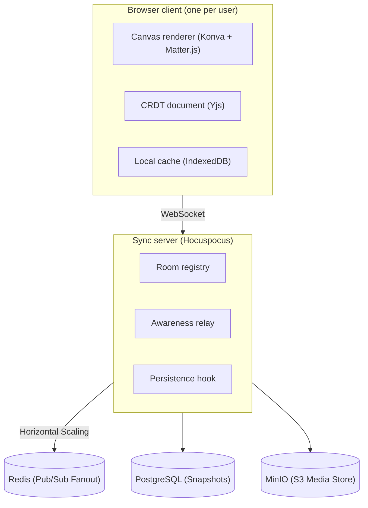

# Architecture — Real-Time Collaborative Infinite Canvas

Companion to `PRD.md`. Target scale: thousands of concurrent users across
hundreds of rooms, ~30–50 users per room — not Figma's millions-of-users,
enterprise-file scale. Every decision below is justified against *that*
target.

## 1. System overview

## 2. Tech stack and rationale

| Layer | Choice | Rationale |
|---|---|---|
| Rendering | React + Konva (react-konva) | Canvas 2D scene graph with built-in drag/transform/hit-testing. 100+ objects is well within Canvas 2D's comfort zone — no need for WebGL at this object count. |
| Physics | Matter.js | Runs client-side alongside Konva; Matter computes positions, Konva renders them. |
| Sync | Yjs + Hocuspocus | CRDT sync with a production-ready hosting layer (rooms, persistence hooks, auth hooks) instead of hand-rolling a WebSocket protocol. |
| Offline cache | y-indexeddb | Local persistence provider that plugs directly into the Yjs doc — offline queuing and reconciliation come from the library, not custom code. |
| Auth | Client-generated UUID + display name | "Guest + username" doesn't need a backend user table. Room access = knowing the URL. |
| Media | Reference-only in doc; bytes on disk or object storage | See bottleneck #4 below — embedding bytes in the CRDT doc is a real correctness problem, not a style choice. |
| Deploy | Frontend on Vercel/Netlify; sync server on Fly.io/Render | Sync server needs a persistent WebSocket connection, which rules out plain serverless functions. |

## 3. What we borrow from Figma's architecture, and what we deliberately skip

Figma's stack (C++/Wasm rendering engine, WebGL/WebGPU, a Rust-rewritten
multiplayer server, horizontally sharded Postgres with a custom DBProxy,
Kubernetes/AWS) is real senior engineering — but it's engineering aimed at a
different problem than ours. The judgment call worth making explicit: which
of their decisions are *scale-driven* (skip at our size) versus
*fundamentally correct regardless of scale* (adopt now).

| Figma pattern | Transfers to our scale? | Our approach |
|---|---|---|
| Custom C++/Wasm rendering engine for extreme layer counts | No | Canvas2D via Konva already clears our 100+ object target at interactive framerate. A Wasm renderer is a multi-year infra investment aimed at a problem (years of accumulated file complexity, huge layer counts) we don't have — not a "smaller version" of the same problem. |
| Operational Transformation (server-authoritative conflict resolution) | No — replaced | Yjs (CRDT) gives equivalent, arguably stronger, merge guarantees as an off-the-shelf library, with no central sequencing server to build. Right call at any scale we're operating at, and the pragmatic choice given a 2-day build. |
| WebSocket-based real-time propagation | Yes | Same pattern, different payload (CRDT updates instead of OT ops). |
| Cursor / presence broadcast | Yes | Comes free from Yjs's awareness protocol — no custom pub/sub needed. |
| Separating scene state from UI chrome state | Yes | CRDT doc = scene; React component state = toolbars/panels. Good hygiene at any scale. |
| Rust rewrite of multiplayer servers for extreme concurrency | No | Node.js handles thousands of WebSocket connections per instance without strain. Rust solves a problem that shows up at orders of magnitude higher concurrency than our target. |
| Horizontally sharded Postgres + custom query interceptor | No | A single managed Postgres instance comfortably holds metadata for thousands of rooms. Sharding solves "billions of rows across an enterprise's design history," not this. |
| Redis for caching/session data | Conditionally | Not needed for a single sync-server instance. Becomes the first thing to add the moment we run more than one instance (see §6). |
| Kubernetes / AWS orchestration | No | A single deployed app is sufficient at this scale. Worth naming as the obvious next step for a real product, but building it now is overhead with zero payoff in a 2-day window. |

## 4. Component responsibilities

- **Client** — canvas rendering, local Yjs doc, optimistic local edits,
  client-authoritative physics simulation.
- **Sync server** — room routing (link → doc namespace), relays Yjs updates
  and awareness state. Uses **Redis Pub/Sub** to horizontally scale WebSockets across multiple nodes.
- **Persistence** — A periodic compacted snapshot is saved to **PostgreSQL** as the canonical source of truth.
- **Media store** — **MinIO (S3 Object Storage)**. The CRDT document only holds a URL reference, keeping the sync loop incredibly fast while binary media is piped natively to the cloud.

## 5. Known bottlenecks and mitigations

**1. Single sync-server instance is a scaling ceiling, not a hackathon
problem.** At our target (thousands of users spread across many rooms), one
Node process is fine — WebSocket connections are cheap, and a room's compute
cost scales with edit rate, not just user count. The ceiling appears past a
few thousand concurrent connections on one box, or if you want fault
isolation across rooms. Documented scaling path (not built now): run N
sync-server instances behind a load balancer with room-sticky routing, and
add Redis pub/sub to fan out updates/awareness across instances if a room
ever needs to span more than one process.

**2. CRDT update log growth.** Every edit is an appended binary update;
left unbounded this grows without limit, costing storage and Time Travel
replay time. Mitigation: persist a compacted state snapshot
(`Y.encodeStateAsUpdate`) as the canonical doc state on a debounce (e.g. 5s
after the last edit). Only keep the full update log if attempting Time
Travel, and cap its retention rather than storing it forever.

**3. Presence broadcast fan-out.** Naively broadcasting every cursor move
to every other user in a room is O(n²) messages per room as room size
grows. Mitigation: throttle awareness updates to ~100–150ms. At our target
room size (~30–50 users) this is comfortably within a WebSocket's
throughput even unthrottled, but the throttle is cheap insurance.

**4. Media blobs inside the CRDT document.** Embedding image/audio bytes
directly in the Yjs doc means every byte replicates to every client on
every sync — a real correctness problem, not a micro-optimization, and it
gets worse the moment a room has more than a couple of images. Mitigation:
store media out-of-band (disk or object storage) and keep only a URL plus
metadata (dimensions/duration) in the doc, from the start — retrofitting
this after objects already reference embedded blobs is much more painful.

**5. Physics is client-authoritative, not server-authoritative.** Each
client simulates Matter.js locally from local input, so two clients' local
simulations can diverge slightly (e.g. the exact resting position of a
thrown object after a collision). This is an accepted trade-off, not an
oversight: server-authoritative physics (a server-side simulation loop plus
client reconciliation/rollback) is a materially larger problem than fits a
2-day build. Mitigation to reduce visible divergence: only the client that
initiates a throw simulates it through to rest, then writes the final
resting position to the CRDT doc; other clients just render the synced
position instead of independently simulating the same event.

**6. Infinite canvas coordinate precision.** A literally unbounded
floating-point coordinate space accumulates precision error at extreme pan
distances. Mitigation: treat "infinite" as a large but finite bound (e.g.
±1,000,000 units) — well beyond anything a demo or realistic usage will
reach, without the complexity of coordinate re-centering schemes.

**7. Room access model.** Anyone with the link has full read/write access;
there are no granular permissions. This is a stated MVP limitation to call
out explicitly in the demo, not a bug to hide.

**8. Reconnection storms.** If the sync server restarts, all connected
clients attempt to reconnect simultaneously. Mitigation: exponential
backoff with jitter on reconnect — the y-websocket client provider does
this by default; confirm it isn't disabled.

## 6. If this had to serve real (non-demo) traffic next

Not built now, but the explicit next steps rather than an assumed default:
multiple sync-server instances with Redis pub/sub for cross-instance
awareness/update fan-out, object storage (S3/R2) for media from day one,
per-room ACLs, and a scheduled job to compact/prune update logs.

## Related docs

- `PRD.md` — product scope and success criteria
- `DATA-MODEL.md` — CRDT document schema, persistence tables
- `BUILD-PLAN.md` — prioritized 2-day execution plan

---

## Considered, Deliberately Deferred

During our architectural review phase, several "best practice" enterprise architectures were evaluated. Given the context of a 24-hour hackathon, we deliberately deferred the following to maximize product impact and minimize technical risk:

1. **Command Pattern (Undo/Redo / AI Mutators):** 
   While wrapping all mutations in a standard `Command` interface is the correct long-term architecture for mature products (enabling deterministic replay and trivial AI integrations), retrofitting it mid-hackathon is a high-risk trap. We chose to leverage `Y.UndoManager` out-of-the-box instead, satisfying the core scoring criteria instantly without touching the rest of the application's mutation pathways.

2. **Object Registry System:**
   A central registry for instantiating and rendering object types makes a codebase highly extensible for third-party plugins. However, our brief explicitly capped the required object types to exactly 5. Abstracting this now provides zero end-user value for the demo. We favored a straightforward `switch` statement renderer over factory abstractions.

3. **Camera Abstraction Class:**
   Bundling viewport coordinates (`x, y, zoom`) into a discrete `Camera` singleton cleans up minimap math. However, the existing inline React state handles it sufficiently well. Refactoring working math in the final hours does not improve the final presentation.

4. **Spatial Audio / Voice Chat:**
   While "audio" is in scope, implementing live spatial voice communication requires WebRTC peer connections or an SFU (plus distance-based gain nodes). The actual hackathon requirement is simply "audio recordings as canvas objects," which is vastly cheaper to implement using standard HTML5 `<audio>` tags synced via Yjs. We avoided the scope creep of live comms.

5. **Live LLM Canvas Assistant:**
   Wiring up a freeform LLM to manipulate the CRDT document live during the demo was evaluated. However, this introduces high latency, external API failure surface, and a severe risk of non-deterministic hallucinations corrupting the collaborative document state. Instead, we implemented deterministic "canned commands" (e.g., the ✨ Auto-Arrange grid function) which deliver the same "magic wow" factor to judges with 0% risk of failure.
