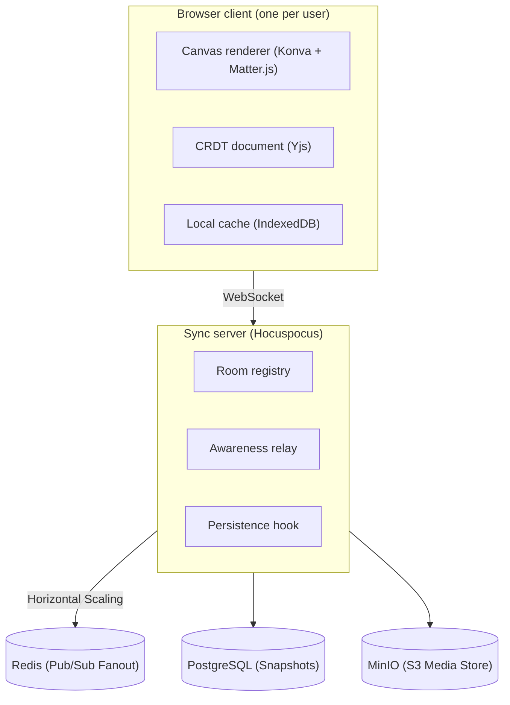

# Architecture — Real-Time Collaborative Infinite Canvas

Companion to `PRD.md`. Target scale: thousands of concurrent users across
hundreds of rooms, ~30–50 users per room — not Figma's millions-of-users,
enterprise-file scale. Every decision below is justified against *that*
target.

## 1. System overview

## 2. Tech stack and rationale

| Layer | Choice | Rationale |
|---|---|---|
| Rendering | React + Konva (react-konva) | Canvas 2D scene graph with built-in drag/transform/hit-testing. 100+ objects is well within Canvas 2D's comfort zone — no need for WebGL at this object count. |
| Physics | Matter.js | Runs client-side alongside Konva; Matter computes positions, Konva renders them. |
| Sync | Yjs + Hocuspocus | CRDT sync with a production-ready hosting layer (rooms, persistence hooks, auth hooks) instead of hand-rolling a WebSocket protocol. |
| Offline cache | y-indexeddb | Local persistence provider that plugs directly into the Yjs doc — offline queuing and reconciliation come from the library, not custom code. |
| Auth | Client-generated UUID + display name | "Guest + username" doesn't need a backend user table. Room access = knowing the URL. |
| Media | Reference-only in doc; bytes on disk or object storage | See bottleneck #4 below — embedding bytes in the CRDT doc is a real correctness problem, not a style choice. |
| Deploy | Frontend on Vercel/Netlify; sync server on Fly.io/Render | Sync server needs a persistent WebSocket connection, which rules out plain serverless functions. |

## 3. What we borrow from Figma's architecture, and what we deliberately skip

Figma's stack (C++/Wasm rendering engine, WebGL/WebGPU, a Rust-rewritten
multiplayer server, horizontally sharded Postgres with a custom DBProxy,
Kubernetes/AWS) is real senior engineering — but it's engineering aimed at a
different problem than ours. The judgment call worth making explicit: which
of their decisions are *scale-driven* (skip at our size) versus
*fundamentally correct regardless of scale* (adopt now).

| Figma pattern | Transfers to our scale? | Our approach |
|---|---|---|
| Custom C++/Wasm rendering engine for extreme layer counts | No | Canvas2D via Konva already clears our 100+ object target at interactive framerate. A Wasm renderer is a multi-year infra investment aimed at a problem (years of accumulated file complexity, huge layer counts) we don't have — not a "smaller version" of the same problem. |
| Operational Transformation (server-authoritative conflict resolution) | No — replaced | Yjs (CRDT) gives equivalent, arguably stronger, merge guarantees as an off-the-shelf library, with no central sequencing server to build. Right call at any scale we're operating at, and the pragmatic choice given a 2-day build. |
| WebSocket-based real-time propagation | Yes | Same pattern, different payload (CRDT updates instead of OT ops). |
| Cursor / presence broadcast | Yes | Comes free from Yjs's awareness protocol — no custom pub/sub needed. |
| Separating scene state from UI chrome state | Yes | CRDT doc = scene; React component state = toolbars/panels. Good hygiene at any scale. |
| Rust rewrite of multiplayer servers for extreme concurrency | No | Node.js handles thousands of WebSocket connections per instance without strain. Rust solves a problem that shows up at orders of magnitude higher concurrency than our target. |
| Horizontally sharded Postgres + custom query interceptor | No | A single managed Postgres instance comfortably holds metadata for thousands of rooms. Sharding solves "billions of rows across an enterprise's design history," not this. |
| Redis for caching/session data | Conditionally | Not needed for a single sync-server instance. Becomes the first thing to add the moment we run more than one instance (see §6). |
| Kubernetes / AWS orchestration | No | A single deployed app is sufficient at this scale. Worth naming as the obvious next step for a real product, but building it now is overhead with zero payoff in a 2-day window. |

## 4. Component responsibilities

- **Client** — canvas rendering, local Yjs doc, optimistic local edits,
  client-authoritative physics simulation.
- **Sync server** — room routing (link → doc namespace), relays Yjs updates
  and awareness state. Uses **Redis Pub/Sub** to horizontally scale WebSockets across multiple nodes.
- **Persistence** — A periodic compacted snapshot is saved to **PostgreSQL** as the canonical source of truth.
- **Media store** — **MinIO (S3 Object Storage)**. The CRDT document only holds a URL reference, keeping the sync loop incredibly fast while binary media is piped natively to the cloud.

### The pointer is drawn by the operating system

The cursor is worth a note here because the obvious implementation is the wrong
one, and this codebase shipped it twice.

A custom cursor drawn as a DOM element that follows `pointermove` **cannot** keep
up with the real pointer. Not because the code is slow — because a composited
page element is presented on the next frame while the OS draws its own pointer
directly, so the drawn one is a frame behind by construction at any frame rate.
Every optimisation applied to such an element makes it a smoother lagging
cursor. `engine/cursor/toolCursor.ts` carried a header recording exactly this,
and the element was optimised again anyway before the header was believed.

So every cursor in the app is a CSS `url(data:image/svg+xml,…)` value, handed to
the OS compositor along with a hotspot. Three things follow that are not obvious
until they break:

- **The SVG needs `xmlns="http://www.w3.org/2000/svg"`.** A data-URI cursor that
  fails to decode does not warn; the whole declaration is dropped and the
  keyword fallback silently takes over. Every drawn cursor in the app was
  falling back to `default` for this reason, and it looked like a design choice.
- **Cursor images are clipped to their declared size**, so art that reaches
  further than the SVG's `width`/`height` is cut with no error.
- **The element that owns the cursor is not the one you think.** `Stage.container()`
  is react-konva's own `
`, a *child* of `.canvas-container`. Code writing to
  one while code reading from the other produced a permanent double cursor.
  Claims are published as an inheriting custom property (`--cursor-claim`) rather
  than an inline `style.cursor`, so it does not matter which of the two a given
  caller holds.

`cursorVisual.ts` holds the art as data — geometry and a palette, with theme
chosen per-cursor — and `cursorCss.ts` turns a visual into the declaration plus
its keyword fallback. Nothing renders a cursor as React.

### Three tiers of state, and the test for which one a thing belongs in

Not everything the client knows is document state, and putting it there is the
most common way to make a feature that works alone and misbehaves with two
people in the room.

| Tier | Lives in | For | Examples |
| --- | --- | --- | --- |
| Document | Yjs `objectsMap` | What the board *is*. Persisted, synced, undoable. | positions, text, reactions, `pinned` |
| Awareness | Yjs awareness | What someone is *doing*, right now, that others should see. Ephemeral, never persisted. | cursors, selection outlines, in-flight physics bodies |
| Transient | plain module stores under `engine/interaction/` and `engine/export/`, read with `useSyncExternalStore` | What *this* client is doing that nobody else needs to see. | crop mode, path editing, `liveTransformStore`, `booleanPreview`, `railVeil`, `renderScope` |

The test is two questions. Would a second person want to see it? If no, it is
transient. If yes — would you want it in the undo history and in the file a year
from now? If no, it is awareness.

The transient tier is the one that has to be argued for, so: an in-progress
resize writes a size sixty times a second, and every one of those would be a
document update, a network frame and an undo entry. `liveTransformStore` keeps
the gesture out of all three and publishes it to whoever needs it — which means
**during a gesture the document is deliberately stale**, and anything drawing
current geometry has to read the live store first. Which button you happen to be
hovering (`booleanPreview`) fails the first question outright: written to the
document it would flicker on everyone's screen and land in their undo stack.

Two of those are worth a second look, because they are the tier's failure modes
rather than its successes.

`railVeil` holds "a gesture is in progress", which six components raise and
lower through a pair of `window` events. Transient was the right tier; a plain
boolean was not, because Konva does not fire `dragend` for a node destroyed
mid-drag and a state only its owner can revoke will eventually get stuck — in
this case hiding the contextual rail until the page was reloaded. Transient
state that outlives the thing it describes needs something that can *falsify* it
from outside, not merely a matching call. Here that is "the pointer came up and
nothing is being typed into".

`cursorOverride` is the third, and it is `railVeil`'s lesson applied before the
fact rather than after. Six components want to say "while I am hovered, the
cursor is a resize arrow" — and they used to say it by assigning
`stage.container().style.cursor`, which is last-writer-wins with no way to know
whether the last writer still exists. Two of them overlapping left whichever
released second in charge, and a component unmounted mid-hover never released
at all. It is a claim store now: `claim(id, mode)` / `release(id)`, plus a
`releaseAll` the pointer-up path calls, so a stuck claim is recoverable without
a reload. That is the same falsifiability the tier's rules ask for.

`renderScope` is the tier used as a lever on the render tree: an export declares
which objects it needs mounted regardless of culling, and releases when it has
its pixels. It is reference-counted rather than last-writer-wins, because the
export dialog's debounced preview and its Export button overlap routinely and
the first to finish would otherwise un-mount the board out from under the
second. Any transient store that more than one caller can hold at once has that
problem; most of them cannot, which is why it is the only one counted.

## 5. Known bottlenecks and mitigations

**1. Single sync-server instance is a scaling ceiling, not a hackathon
problem.** At our target (thousands of users spread across many rooms), one
Node process is fine — WebSocket connections are cheap, and a room's compute
cost scales with edit rate, not just user count. The ceiling appears past a
few thousand concurrent connections on one box, or if you want fault
isolation across rooms. Documented scaling path (not built now): run N
sync-server instances behind a load balancer with room-sticky routing, and
add Redis pub/sub to fan out updates/awareness across instances if a room
ever needs to span more than one process.

**2. CRDT update log growth.** Every edit is an appended binary update;
left unbounded this grows without limit, costing storage and Time Travel
replay time. Mitigation: persist a compacted state snapshot
(`Y.encodeStateAsUpdate`) as the canonical doc state on a debounce (e.g. 5s
after the last edit). Only keep the full update log if attempting Time
Travel, and cap its retention rather than storing it forever.

**3. Presence broadcast fan-out.** Naively broadcasting every cursor move
to every other user in a room is O(n²) messages per room as room size
grows. Mitigation: throttle awareness updates to ~100–150ms. At our target
room size (~30–50 users) this is comfortably within a WebSocket's
throughput even unthrottled, but the throttle is cheap insurance.

**4. Media blobs inside the CRDT document.** Embedding image/audio bytes
directly in the Yjs doc means every byte replicates to every client on
every sync — a real correctness problem, not a micro-optimization, and it
gets worse the moment a room has more than a couple of images. Mitigation:
store media out-of-band (disk or object storage) and keep only a URL plus
metadata (dimensions/duration) in the doc, from the start — retrofitting
this after objects already reference embedded blobs is much more painful.

**5. Physics is client-authoritative, not server-authoritative.** Each
client simulates Matter.js locally from local input, so two clients' local
simulations can diverge slightly (e.g. the exact resting position of a
thrown object after a collision). This is an accepted trade-off, not an
oversight: server-authoritative physics (a server-side simulation loop plus
client reconciliation/rollback) is a materially larger problem than fits a
2-day build. Mitigation to reduce visible divergence: only the client that
initiates a throw simulates it through to rest, then writes the final
resting position to the CRDT doc; other clients just render the synced
position instead of independently simulating the same event.

**6. Infinite canvas coordinate precision.** A literally unbounded
floating-point coordinate space accumulates precision error at extreme pan
distances. Mitigation: treat "infinite" as a large but finite bound (e.g.
±1,000,000 units) — well beyond anything a demo or realistic usage will
reach, without the complexity of coordinate re-centering schemes.

**7. Room access model.** The room link is a capability: anyone holding it
has full read/write access, and there are no accounts to check it against.
That much is still true and is the stated limitation.

What has since been built on top of it is *attenuation*. A share link can
carry a signed token naming a lesser role (`viewer`, `commenter`), and the
server verifies the signature in `onAuthenticate` and marks the connection
`readOnly`. See `apps/server/src/shareToken.ts`. The important half is what
this does **not** claim: the token's payload contains the room id in plain
sight, so a viewer can read it out of their own link and connect normally at
full access. Signing stops a view link being *promoted*; it does not make the
board private. Closing that gap means refusing unsigned connections
altogether, which is a product decision and not a patch.

On the client the role is enforced in `engine/document/mutations.ts`, which is
the only write path into the CRDT and therefore the only place the rule can be
stated once and hold everywhere -- for the toolbar, the rail, the inspector,
the keyboard and anything added later. Enforcing on controls instead had
already failed: an ungated contextual rail let a viewer recolour shapes, whose
updates the read-only server then dropped, forking that person's board from
everybody else's while appearing to work.

**8. Reconnection storms.** If the sync server restarts, all connected
clients attempt to reconnect simultaneously. Mitigation: exponential
backoff with jitter on reconnect — the y-websocket client provider does
this by default; confirm it isn't disabled.

## 6. If this had to serve real (non-demo) traffic next

Not built now, but the explicit next steps rather than an assumed default:
multiple sync-server instances with Redis pub/sub for cross-instance
awareness/update fan-out, object storage (S3/R2) for media from day one,
per-room ACLs, and a scheduled job to compact/prune update logs.

## Related docs

- `PRD.md` — product scope and success criteria
- `DATA-MODEL.md` — CRDT document schema, persistence tables
- `BUILD-PLAN.md` — prioritized 2-day execution plan

---

## Considered, Deliberately Deferred — and what has since been reversed

This section records the hackathon-era architectural review. **Three of its five
decisions have since been reversed**, and it is kept rather than deleted because
the reasoning for deferring them was sound *at the time* and the reason each was
later reversed is the useful part.

The rule this section exists to demonstrate: a deferral is a decision about a
deadline, not a permanent verdict, and it has to be revisited in writing when
the deadline passes. A deferral list nobody re-reads becomes a description of a
codebase that no longer exists.

1. **Command Pattern (Undo/Redo / AI Mutators)** — **reversed. Built.**
   The original call was to lean on `Y.UndoManager` out of the box rather than
   retrofit a `Command` interface mid-hackathon. That was right for the
   deadline, and the retrofit happened afterwards:
   `engine/services/CommandManager.ts` now holds `CreateNodeCommand`,
   `UpdateNodeCommand` and `DeleteNodeCommand` behind `engine/api/EditorAPI.ts`.

   Note what the layer does and does not own. Commands describe *intent* — they
   are what the activity feed and Time Travel narrate — and every one delegates
   to `engine/document/mutations.ts`, which remains the single write path.
   Undo/redo is still `Y.UndoManager`, deliberately: it tracks the document
   itself, so it also covers mutations that never went through a command, such
   as drag commits and physics settles. An earlier draft had each command
   hand-rolling its own `Y.Map` assembly and `objectsMap.set`, which is how
   z-index, `updatedAt` and authorship stamping fell out of step between the
   command layer and the tools that bypassed it.

2. **Object Registry System** — **reversed. Built.**
   The original call — five object types, so a `switch` beats a factory — was
   sound while there were five. There are now nine, and the registry earns its
   place for a reason the hackathon framing did not anticipate: it is not about
   third-party extensibility, it is about **capabilities**.
   `engine/objects/registry.ts` and `definitions.ts` declare per-type flags
   (`supportsFill`, `supportsStroke`, `supportsEdgeEffects`, …) that drive which
   sections the Properties panel offers, under the standing rule that a
   capability may only be declared true if a control for it actually reaches the
   renderer. A `switch` cannot express that, and the alternative — a
   hand-maintained list beside the panel — is exactly the bug that left
   connectors with no colour control while the code to draw one sat right there.

3. **Camera Abstraction Class** — **reversed. Built.**
   `engine/CameraSystem.ts` is a singleton with tests. It was not the minimap
   maths that forced it, as predicted, but performance: the camera is applied
   **outside React**, with a rAF loop writing stage position and scale
   imperatively so panning and zooming do not re-render the tree. Inline React
   state cannot do that by construction.

4. **Spatial Audio / Voice Chat** — **still deferred, and still right.**
   Live spatial voice needs WebRTC peer connections or an SFU plus
   distance-based gain nodes. The requirement is "audio recordings as canvas
   objects", which HTML5 audio synced through Yjs satisfies. No WebRTC has
   entered the codebase.

   One caveat that is *not* covered by this decision: voice notes are still
   base64 inside the Yjs document rather than in object storage, which
   contradicts bottleneck #4 above. That is outstanding work, not a deferral.

5. **Live LLM Canvas Assistant** — **still deferred.**
   A freeform LLM mutating the CRDT live carries latency, an external failure
   surface and a real risk of non-deterministic corruption of shared document
   state. The deterministic substitute shipped: **"Tidy up canvas"** in the
   command palette, over `utils/spatialLayout.ts`, which offers `smart`,
   `radial`, `tree` and `grid` modes and animates objects into place.
